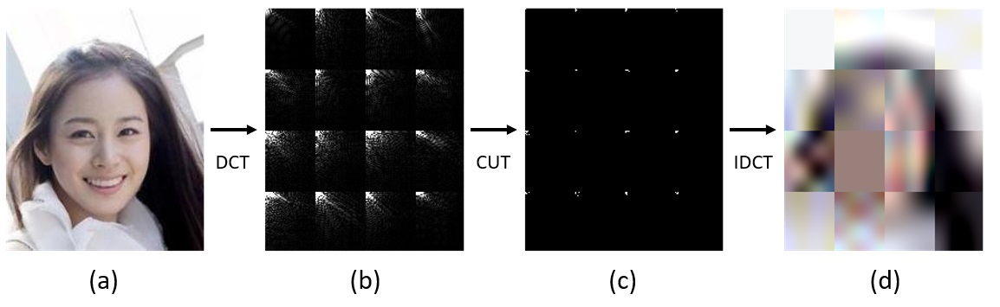
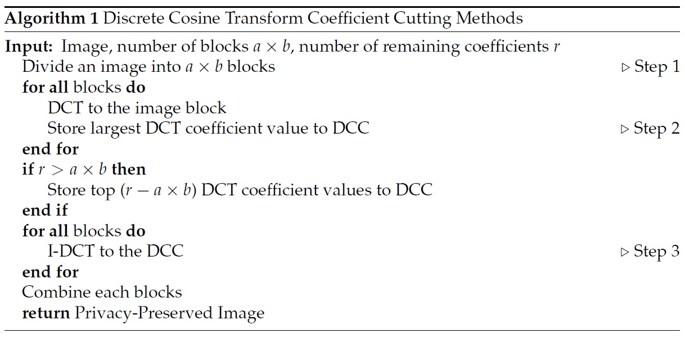

## Discrete Cosine Transform Coefficient Cutting Methods (DCC) 
Implementation of "[**Image Perturbation-Based Deep Learning for Face Recognition Utilizing Discrete Cosine Transform**](https://www.mdpi.com/2079-9292/11/1/25)" by Jaehun Park and Kwangsu Kim.



***Step 1 ((a)->(b)) Discrete Cosine Transform (DCT)***
>The original image is divided into several blocks, and each block is transformed from the spatial domain to the frequency domain by DCT and displayed as the DCT coefficient matrix.

***Step 2 ((b)->(c)) Coefficient Cutting (CUT)***
>The DCT coefficient matrix is filtered by coefficient cutting methods, such that only a few high-frequency coefficients in the DCC coefficient matrix remain.

***Step 3 ((c)->(d)) Inverse Discrete Cosine Transform (IDCT)***
>The DCC coefficient matrix is transformed from the frequency domain to the spatial domain by IDCT per block. 



To get a DCC-transformed image, put the image into *sample.jpg* and run this code:

    python sample.py
    
If you want to change parameters, then run this code:

    python sample.py --a=4 --b=6 --r=128
    
To train face recognition tasks, run this code:

    python train.py

If you want to change parameters, then run this code:

    python train.py --a=4 --b=6 --r=128 --epochs=20

## Citation

```bibtex
@Article{electronics11010025,
AUTHOR = {Park, Jaehun and Kim, Kwangsu},
TITLE = {Image Perturbation-Based Deep Learning for Face Recognition Utilizing Discrete Cosine Transform},
JOURNAL = {Electronics},
VOLUME = {11},
YEAR = {2022},
NUMBER = {1},
ARTICLE-NUMBER = {25},
URL = {https://www.mdpi.com/2079-9292/11/1/25},
ISSN = {2079-9292},
ABSTRACT = {Face recognition, including emotion classification and face attribute classification, has seen tremendous progress during the last decade owing to the use of deep learning. Large-scale data collected from numerous users have been the driving force in this growth. However, face images containing the identities of the owner can potentially cause severe privacy leakage if linked to other sensitive biometric information. The novel discrete cosine transform (DCT) coefficient cutting method (DCC) proposed in this study combines DCT and pixelization to protect the privacy of the image. However, privacy is subjective, and it is not guaranteed that the transformed image will preserve privacy. To overcome this, a user study was conducted on whether DCC really preserves privacy. To this end, convolutional neural networks were trained for face recognition and face attribute classification tasks. Our survey and experiments demonstrate that a face recognition deep learning model can be trained with images that most people think preserve privacy at a manageable cost in classification accuracy.},
DOI = {10.3390/electronics11010025}
}
```
